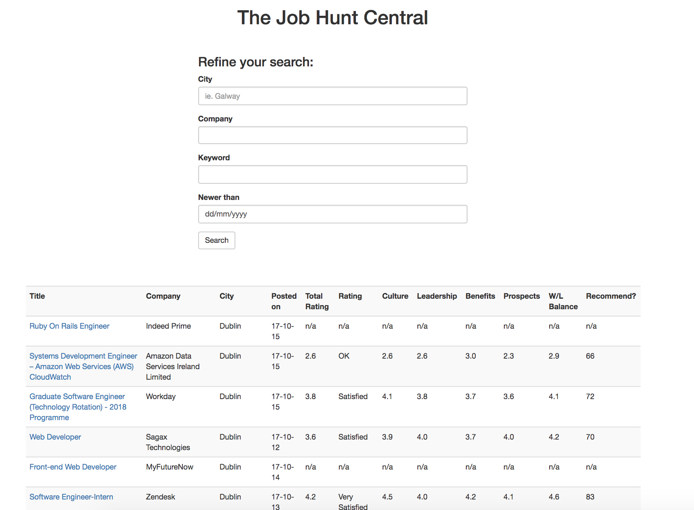

#  Job Search App in Sinatra

This small application uses WebScrapper with Mechanize Gem for scrapping through the Indeed.com search results by keywords, dates, city name, company name. Then mashes it up with company review data from Glassdoor.com (ie. Glassdor's company rating, prospects, culture and other users' votes).Â

Also, by using Free Geo IP (which returns a JSON object with your location by the IP address you send the data request from), it automatically fills in city name if you do not specify yours.




## Getting Started

If you want to quick run some the examples to see the code in action, and you have installed Ruby and Sinatra, run
```
$ ruby app.rb
```

Open browser on http://localhost:4567/

## Authors

* **Dariusz Biskupski** - *Initial work* - https://dariuszbiskupski.com


## Acknowledgments

The assignment is created for [Viking Code School](https://www.vikingcodeschool.com/)
